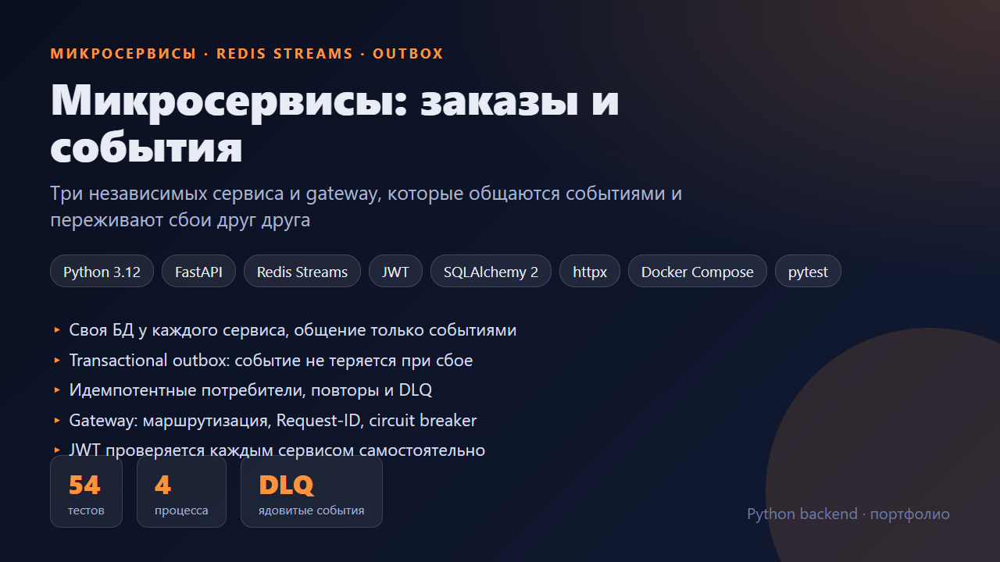
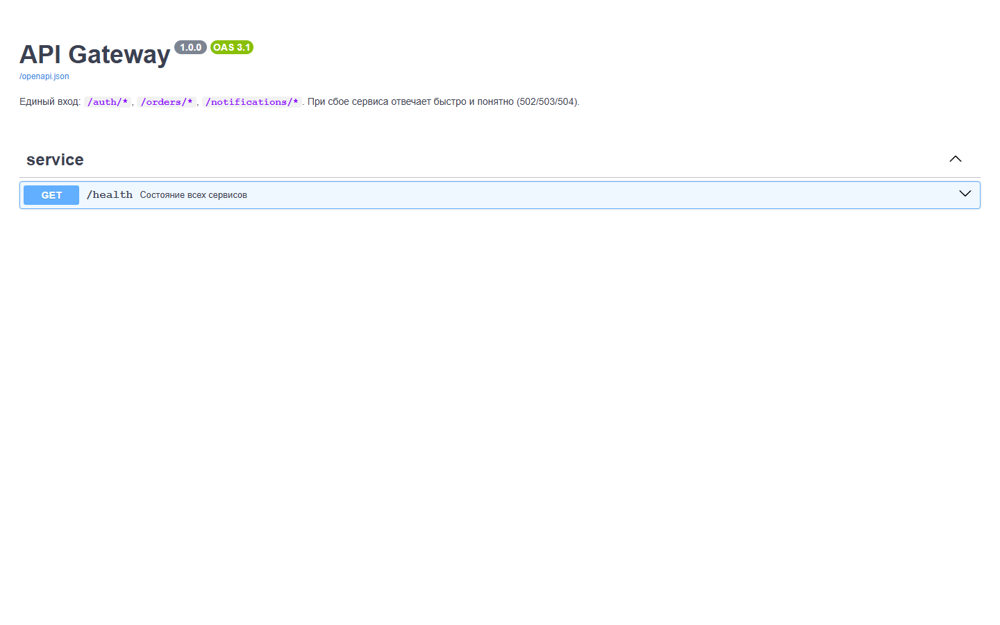
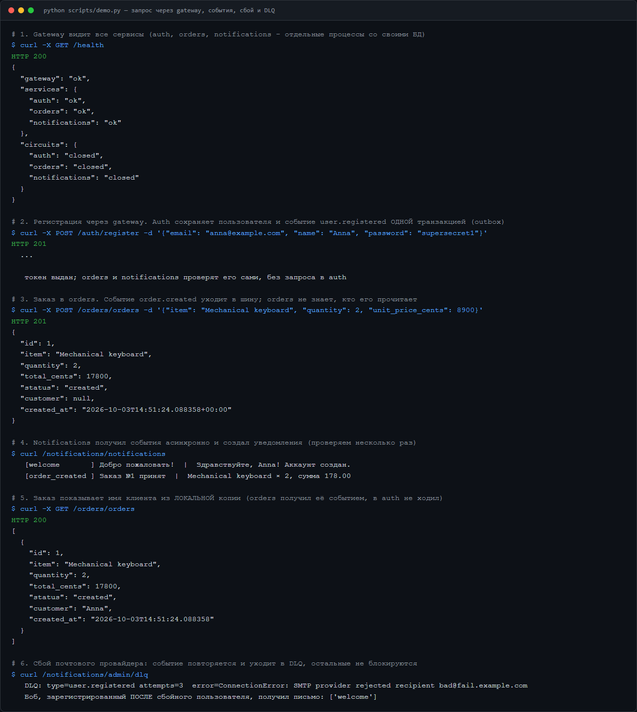
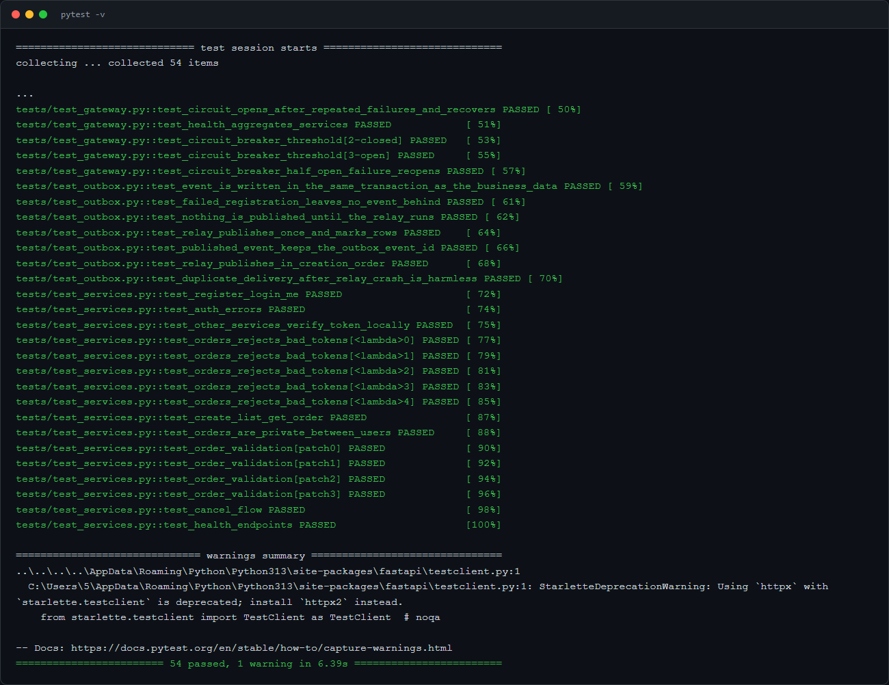

# Микросервисы: заказы и события

Три независимых сервиса и gateway. Сервисы не вызывают друг друга напрямую, а обмениваются событиями через Redis Streams. Проект показывает, как сделать такую систему надёжной: события не теряются, дубли не вредят, а сбой одного сервиса не ломает остальные.



## Состав

```
            ┌────────────┐
 клиент ───>│  gateway   │  маршрутизация, X-Request-ID, circuit breaker
            └─────┬──────┘
      ┌───────────┼──────────────┐
      ▼           ▼              ▼
  ┌───────┐   ┌────────┐   ┌───────────────┐
  │ auth  │   │ orders │   │ notifications │     у каждого своя БД
  └───┬───┘   └───┬────┘   └──────▲────────┘
      │ outbox    │ outbox        │ consumer group
      └───────────┴──► Redis Streams ("events") ──► DLQ
```

| Сервис | Отвечает за | Публикует | Слушает |
|---|---|---|---|
| **auth** | регистрация, вход, JWT | `user.registered` | — |
| **orders** | заказы, локальная копия клиентов | `order.created`, `order.cancelled` | `user.registered` |
| **notifications** | письма клиентам | — | `user.registered`, `order.created`, `order.cancelled` |
| **gateway** | единая точка входа | — | — |

## Какие проблемы решены

| Проблема | Решение |
|---|---|
| «Записал в БД, а событие не отправилось» | **Transactional outbox**: событие пишется в ту же транзакцию, что и данные. Отдельный релей публикует его в шину. Неудачная регистрация не оставляет события |
| Релей упал после публикации | Событие уйдёт второй раз. Потребители **идемпотентны**: таблица `processed_events` и отметка в одной транзакции с побочным эффектом |
| Обработчик упал | Событие не подтверждено (`XACK` только после успеха) и вернётся в обработку. После 3 попыток уходит в **DLQ** с причиной, а следующие события не блокируются |
| Сервис временно недоступен | Шина копит события, сервис обработает их при возвращении. Остальные сервисы продолжают работать |
| Orders нужны имя и e-mail клиента | **Локальная копия** данных (read model) обновляется событиями, синхронных вызовов в auth нет |
| Проверка токена | Каждый сервис проверяет JWT сам (подпись и срок), без запроса к auth на каждый вызов |
| Один сервис «лёг» и тянет за собой остальных | В gateway **circuit breaker**: после 3 ошибок подряд быстрый `503` вместо ожидания таймаутов, затем пробный запрос |
| Сквозная диагностика | `X-Request-ID` создаётся в gateway и пробрасывается дальше |

**Компромиссы.** Система *eventually consistent*: сразу после создания заказа в ответе может быть `customer: null`, а через доли секунды уже имя клиента (видно в демо). Порядок событий гарантирован внутри одного сервиса, но не между разными. Если отправка письма удалась, а коммит БД упал, письмо уйдёт повторно: для внешних побочных эффектов гарантия «минимум один раз».

## Запуск

Всё одной командой, без Docker и без Redis (внутри `fakeredis` в режиме TCP-сервера: настоящий протокол Redis, Streams, группы потребителей):

```bash
pip install -r requirements.txt
python scripts/dev.py --fresh        # gateway на http://localhost:8000/docs, сервисы отдельными процессами
python scripts/demo.py               # сценарий со скриншота
pytest                               # 54 теста
```

Production-подобный запуск с настоящим Redis:

```bash
docker compose up --build            # gateway :8000, redis, три сервиса со своими томами данных
```

> `docker compose` здесь написан и валидируется, но полный запуск образов в рамках подготовки репозитория не выполнялся. Логика сервисов и шины проверена тестами и многопроцессным запуском `scripts/dev.py`.

## Скриншоты

| Swagger gateway | Демо-сценарий | Тесты |
|---|---|---|
|  |  |  |
